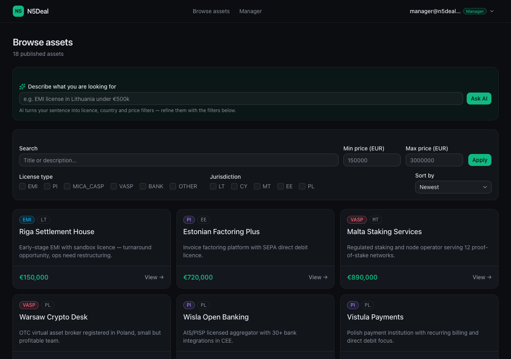
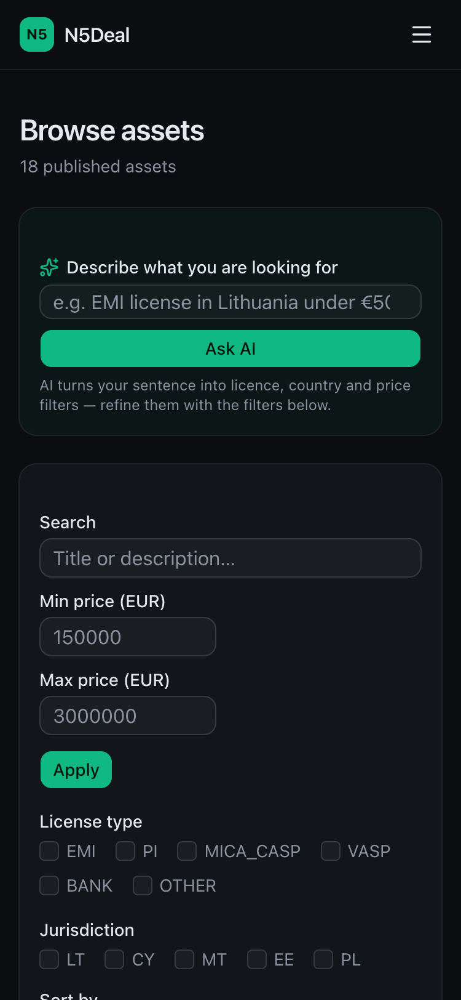
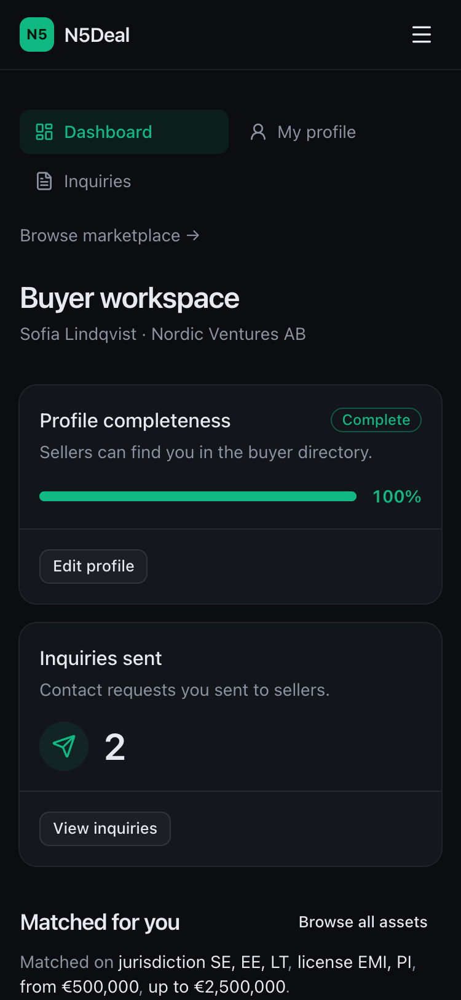
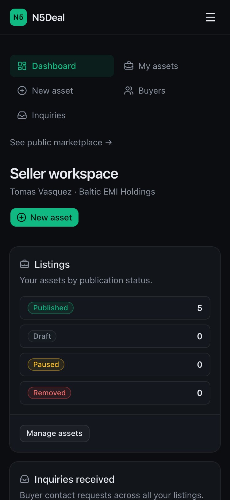
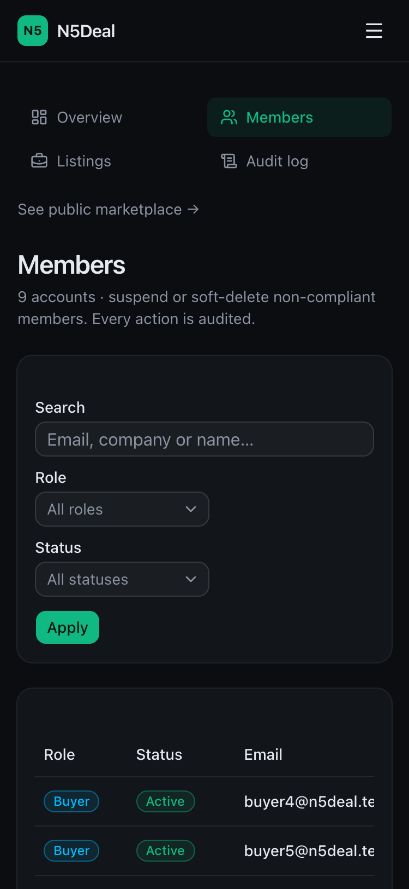
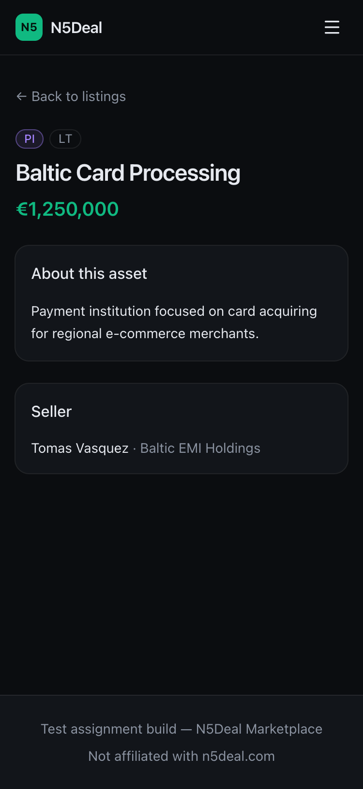
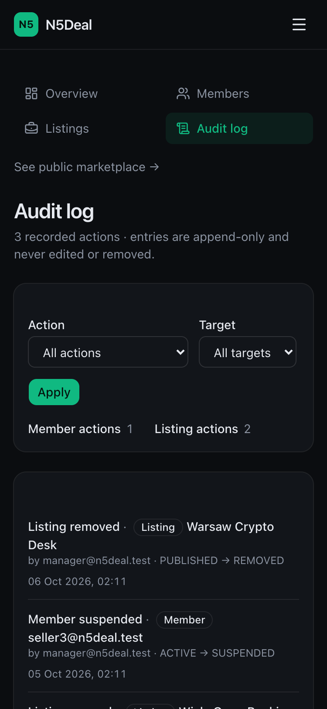
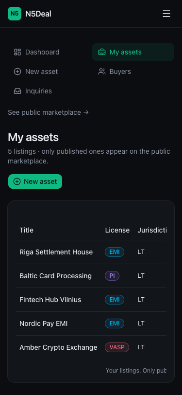
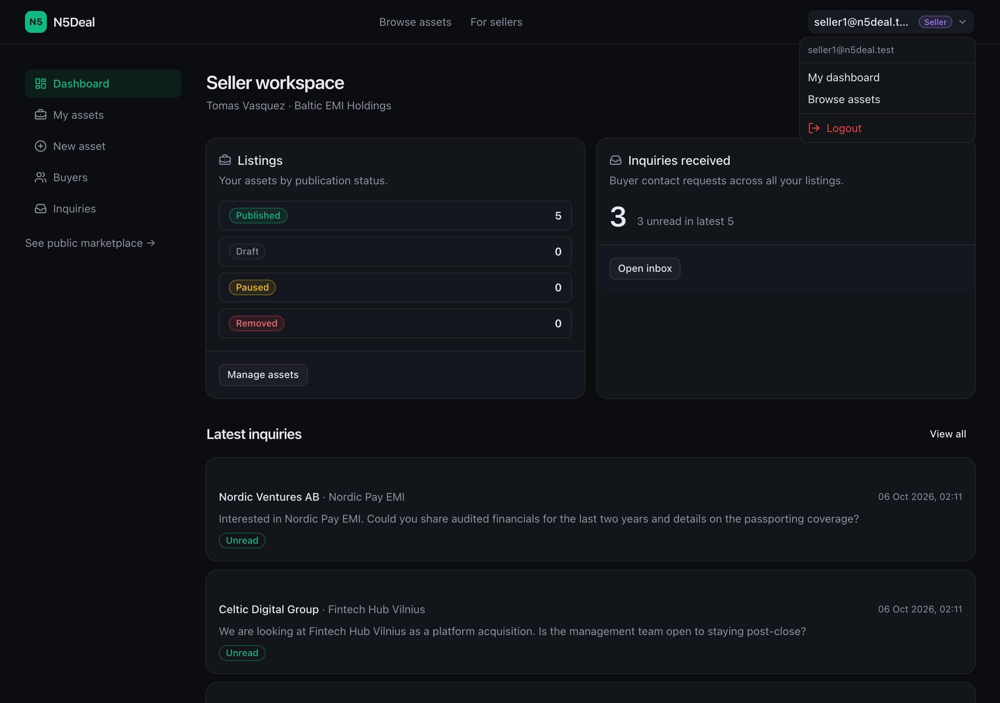

# N5Deal Marketplace

B2B marketplace for regulated financial products — EMI, PI, MiCA/CASP, VASP and
banking licences. Buyers publish what they are looking for and their budget,
sellers list concrete assets, the two exchange inquiries **without ever seeing
each other's contacts**, and a manager moderates both sides.

Demo accounts and the 5-minute script live in [`docs/DEMO.md`](docs/DEMO.md);
design and trade-off rationale in [`docs/ARCHITECTURE.md`](docs/ARCHITECTURE.md).

**Live: https://minimarketplace-six.vercel.app** (Vercel + Neon Postgres,
same seed as local).

## Quick start

```bash
cp .env.example .env      # creates prisma/dev.db and enables Auth.js + AI fallback
echo "AUTH_SECRET=\"$(openssl rand -base64 32)\"" >> .env   # JWT signing key
npm i
npx prisma migrate dev    # creates prisma/dev.db from the 3 migrations
npm run db:seed           # 9 users, 24 assets, 10 inquiries, 3 audit entries
npm run dev               # http://localhost:3000
```

One-liner after the two file edits above:

```bash
npm i && npx prisma migrate dev && npm run db:seed && npm run dev
```

AI smart search works without an API key: `POST /api/smart-search` falls back to
keyword search and the UI shows a toast. Add `OPENAI_API_KEY` in `.env` to get
natural-language filtering ("cheap emi in lithuania under 300k").

Requirements: Node 20.9+ (or 22), npm 10+. No database server, no Docker, no
external services.

## Demo accounts

All demo passwords are `password123`.

| Role             | Email                 | Password      | Use this to see                                 |
| ---------------- | --------------------- | ------------- | ----------------------------------------------- |
| Manager          | `manager@n5deal.test` | `password123` | moderation queues + audit log                   |
| Seller           | `seller1@n5deal.test` | `password123` | publishing flow, unread inquiries, buyer search |
| Buyer            | `buyer1@n5deal.test`  | `password123` | profile, matched sellers, outgoing inquiries    |
| Suspended seller | `seller3@n5deal.test` | `password123` | login is refused with `account_suspended`       |

There are more buyers (`buyer2`…`buyer5`) and sellers (`seller2`) so filters and
pagination have something to page through.

## Feature map

| Role    | Feature                                                                                       | Route                           | Where it lives                                                         |
| ------- | --------------------------------------------------------------------------------------------- | ------------------------------- | ---------------------------------------------------------------------- |
| Guest   | Landing page with domain counts                                                               | `/`                             | `src/app/page.tsx`                                                     |
| Guest   | Filterable catalogue: licence type, jurisdiction, price range, text, 3 sort modes, pagination | `/assets`                       | `components/assets/FilterBar.tsx`, `lib/db/repositories/assets.ts`     |
| Guest   | Asset card with status/licence badges, seller name, price                                     | `/assets/[id]`                  | `toDomain`, `components/assets/AssetCard.tsx`                          |
| Guest   | Natural-language smart search with explanation + degraded fallback                            | `/assets?ai=1&q=…`              | `src/lib/ai/smartSearch.ts`, `app/api/smart-search/route.ts`           |
| Guest   | Auth pages with inline + toast validation errors                                              | `/login`, `/register`           | `src/server/auth.ts`, `lib/validation/auth.ts`                         |
| Buyer   | Dashboard: profile completeness, criteria chips, listings matched to the profile              | `/buyer`                        | `listAssets` with the buyer's own criteria                             |
| Buyer   | Interest profile: jurisdictions, licence types, budget, description                           | `/buyer/profile`                | `upsertBuyerProfile`, `buyerProfileSchema`                             |
| Buyer   | Contact seller on an asset (blind — no seller contact data)                                   | `/assets/[id]`                  | `server/buyer.ts` → `createInquiry`, `initiatorRole = BUYER`           |
| Buyer   | Read-only view of which sellers contacted them                                                | `/buyer/inquiries`              | `listInquiriesForBuyer` (seller messages land here)                    |
| Seller  | Dashboard: status counts, unread inquiry badge, matched buyer profiles                        | `/seller`                       | `listSellerAssets`, `countIncomingInquiries`, `listBuyers`             |
| Seller  | Create / edit assets with `draft` vs `publish` intent                                         | `/seller/assets/new`, `/…/edit` | `lib/validation/seller.ts`, `assetsRepo`                               |
| Seller  | Status changes: publish, pause, reinstate                                                     | `/seller/assets`                | `setAssetStatus` + `assetStatusActionSchema`                           |
| Seller  | Blind buyer search: name/company, jurisdictions, licences, budget                             | `/seller/buyers`                | `listBuyers`, `buyerSearchSchema`                                      |
| Seller  | Contact buyer about one of your assets (`initiatorRole = SELLER`)                             | `/seller/buyers/[id]`           | `sendBuyerMessage`                                                     |
| Seller  | Inquiry inbox with unread counters and mark-as-read                                           | `/seller/inquiries`             | `listIncomingInquiries`, `markInquiriesRead` via `markInquiriesAsRead` |
| Manager | Moderation: suspend / reactivate / soft-delete users                                          | `/manager/users`                | `moderateUser`, `USER_AUDIT_ACTION`                                    |
| Manager | Moderation: publish / pause / remove assets                                                   | `/manager/assets`               | `moderateAsset`, `ASSET_AUDIT_ACTION`                                  |
| Manager | Append-only audit log with actor, target and JSON meta                                        | `/manager/audit`                | `AuditLog`, `createAuditLog`                                           |
| Cross   | 404 / error / global-error boundaries, skeletons, empty states                                | `not-found.tsx`, `error.tsx`    | `src/components/ui/*`                                                  |
| Cross   | Token-based dark theme, AA contrast, keyboard-scrollable tables, mobile Sheet nav             | layout, `globals.css`           | `lib/badgeStyles.ts`, `SiteHeader`, `components/ui/sheet`              |

## Requirements checklist (vs `docs/tasks/`)

| Task | Requirement                                                                                                                                                                                                                          | Status | Where                                                                                                |
| ---- | ------------------------------------------------------------------------------------------------------------------------------------------------------------------------------------------------------------------------------------ | ------ | ---------------------------------------------------------------------------------------------------- |
| 01   | Next.js 15 App Router, TS strict, Tailwind, shadcn set, `src/` layout                                                                                                                                                                | done   | `src/`, `components.json`, no new runtime deps beyond the spec                                       |
| 02   | User / BuyerProfile / Asset / Inquiry models, enums, migrations, seed                                                                                                                                                                | done   | `prisma/schema.prisma`, `prisma/migrations/`, `prisma/seed.ts`                                       |
| 03   | Auth.js v5 Credentials + bcrypt + JWT, `requireUser` / `requireRole`, login & register (no MANAGER self-signup), suspended rejected                                                                                                  | done   | `src/lib/auth/`, `src/server/auth.ts`, `/login`, `/register`                                         |
| 04   | Public `/assets` + `/assets/[id]`, shareable URL-driven filters (licence, jurisdiction, price, `q`, sort, reset)                                                                                                                     | done   | `components/assets/FilterBar.tsx`, `lib/db/repositories/assets.ts`                                   |
| 05   | Buyer dashboard (completeness, match strip, inquiry count), profile form, contact seller, `/buyer/inquiries`                                                                                                                         | done   | `src/app/buyer/`, `src/server/buyer.ts`                                                              |
| 06   | Seller dashboard, own-assets table with publish/pause/soft-delete, draft vs publish form, buyer search + contact, inquiry inbox with unread + mark-as-read                                                                           | done   | `src/app/seller/`, `src/server/seller.ts`                                                            |
| 07   | Manager dashboard, users table with filters and suspend/reactivate/soft-delete (MANAGER guarded), assets moderation, `AuditLog` on every mutation, paginated/filterable audit page                                                   | done   | `src/app/manager/`, `src/server/manager.ts`                                                          |
| 08   | Smart-search bar, `/api/smart-search`, strict JSON prompt, **Zod-validated LLM output with keyword fallback**, explanation banner, 10 req/min rate limit, env vars, unit-tested `parseQuery`                                         | done   | `src/lib/ai/`, `app/api/smart-search/route.ts`                                                       |
| 09   | Visual pass, skeletons, `error.tsx` / `not-found.tsx`, toast on every mutation, a11y (labels, aria, AA contrast measured), responsive (mobile menu; tables use horizontal scroll — documented), hover/transition polish, screenshots | done   | `src/components/`, `globals.css`, [ARCHITECTURE § UI polish](docs/ARCHITECTURE.md#ui-polish-task-09) |
| 10   | Vitest setup, repository tests on a test DB, validation tests, ARCHITECTURE with all required sections, README, DEMO, deploy or documented blocker                                                                                   | done   | `test/`, `src/**/*.test.ts`, this README, `docs/DEMO.md`, `docs/SELF-REVIEW.md`                      |

Working agreements from `00-CONTEXT.md`: every input goes through Zod, all DB
access goes through `lib/db/*` repositories (components never import `prisma`),
mutations are server actions with `/api/smart-search` as the single REST
endpoint, and no dependency was added beyond the ones the tasks specified.

The final self-review for the assignment — test run summary, live URL and
the against-the-spec checklist — is in
[docs/SELF-REVIEW.md](docs/SELF-REVIEW.md).

## Scripts

| Script                 | What it does                                   |
| ---------------------- | ---------------------------------------------- |
| `npm run dev`          | Next dev server on :3000 (turbopack)           |
| `npm run build`        | Production build                               |
| `npm start`            | Serve the production build                     |
| `npm test`             | Vitest, one run — 191 tests across 7 files     |
| `npm run test:watch`   | Vitest in watch mode                           |
| `npm run lint`         | ESLint                                         |
| `npm run format:check` | Prettier check (use `npm run format` to write) |
| `npm run db:seed`      | Re-run the idempotent demo seed                |
| `npm run db:reset`     | Drop, re-migrate and re-seed the dev database  |

Tests use their own SQLite file (`prisma/test.db`) and reset it before each run,
so `npm test` never touches `prisma/dev.db`. See
[Testing](docs/ARCHITECTURE.md#testing-task-10).

## Environment variables

| Variable          | Required         | Default                     | Notes                                                                                                                                    |
| ----------------- | ---------------- | --------------------------- | ---------------------------------------------------------------------------------------------------------------------------------------- |
| `DATABASE_URL`    | yes              | `file:./dev.db`             | SQLite file relative to `prisma/`. Swap to `postgresql://…` for prod.                                                                    |
| `AUTH_SECRET`     | yes for real use | —                           | `echo "AUTH_SECRET=\"$(openssl rand -base64 32)\"" >> .env`. Without it Auth.js throws `MissingSecret` on `/api/auth/*` in `next start`. |
| `OPENAI_API_KEY`  | no               | empty                       | Without it smart search degrades to keyword search.                                                                                      |
| `OPENAI_MODEL`    | no               | `gpt-4o-mini`               | Any OpenAI chat-completions model that supports `json_object`.                                                                           |
| `OPENAI_BASE_URL` | no               | `https://api.openai.com/v1` | Point at an OpenAI-compatible gateway or a local mock.                                                                                   |

`.env` is git-ignored; only `.env.example` is committed.

## Deployment

**Live: https://minimarketplace-six.vercel.app** — Vercel (project
`minimarketplace`), database on Neon Postgres. The setup, so it can be repeated:

1. **Postgres for the runtime.** Vercel's filesystem is ephemeral and cannot
   hold `prisma/dev.db`. The schema was applied to a Neon project with
   `prisma db execute` from a `prisma migrate diff` baseline generated from
   `schema.prisma`, then seeded **once** from a local machine. The full
   documented swap — `text[]` arrays, `directUrl`, migration flow — is in
   [SQLite → Postgres: exact sequence](docs/ARCHITECTURE.md#sqlite--postgres-exact-sequence).
2. **Build-time provider swap.** The repo stays on SQLite for local dev;
   `vercel.json` rewrites `provider = "sqlite"` → `"postgresql"` inside the
   build container only, then runs `prisma generate && next build`. The
   committed schema, migrations and `npm run dev` / `npm run build` are
   untouched.
3. **Environment variables** — set with `npx vercel env add … production`:
   `DATABASE_URL` (pooled Neon endpoint, runtime), `DIRECT_URL` (direct
   endpoint, one-off schema work), `AUTH_SECRET` (fresh value — without it
   Auth.js refuses every login). `OPENAI_API_KEY` is intentionally absent:
   smart search falls back to keyword mode, as documented.
4. **Seed once, manually.** Do **not** run `npm run db:seed` on every deploy —
   it would overwrite demo edits. Re-seed only when you want a fresh dataset:
   point a local `DATABASE_URL` at Neon and run it once.
5. **Deploy:** `npx vercel --prod` (the directory is already `vercel link`ed),
   or push to `dev` and let Vercel's Git integration build it (the connected
   repository and production branch are both `dev`).
6. **Post-deploy check:** guest → `/buyer` redirects to `/login`; buyer and
   manager sign in and load their dashboards; `seller3@n5deal.test` is refused
   with `account_suspended`; `/assets` shows 20 published listings from Neon.

## Screenshots

Captured from the running app (headless Chrome, 1280px and 375px):

<p>
  
  &nbsp;
  
</p>

| Buyer 375px                                                        | Seller 375px                                                          | Manager: users 375px                                             |
| ------------------------------------------------------------------ | --------------------------------------------------------------------- | ---------------------------------------------------------------- |
|  |  |  |

| Asset detail 375px                                     | Manager audit log                                            | Mobile drawer 375px                                    | Desktop session menu                                  |
| ------------------------------------------------------ | ------------------------------------------------------------ | ------------------------------------------------------ | ----------------------------------------------------- |
|  |  |  |  |

## Project layout

```
src/
  app/                     routes (RSC pages) + api/smart-search
  components/              ui primitives, layout, feature components
  lib/ai/                  smartSearch.ts, llmClient.ts, rateLimit.ts (+ test)
  lib/auth/                guards.ts, permissions.ts, config
  lib/db/                  prisma singleton + repositories/ (+ repository test)
  lib/validation/          Zod schemas for every input (+ tests)
  server/                  server actions per role, shared ActionResult type
  types/                   domain types, enums, badges copy
prisma/                    schema, 3 migrations, seed, dev.db (ignored)
docs/                      ARCHITECTURE.md, DEMO.md, tasks/
test/                      globalSetup.ts — test-database bootstrap
```

## Known limitations

- SQLite for local dev; see [SQLite → Postgres: exact sequence](docs/ARCHITECTURE.md#sqlite--postgres-exact-sequence) for production.
- AI rate limit is an in-memory `Map` (resets on deploy, not shared across instances).
- One inquiry per `(asset, buyer)` per direction — no threaded replies.
- `%` and `_` in catalogue search act as LIKE wildcards (documented and pinned by a test).
- No e-mail confirmation, password reset, or file uploads.
